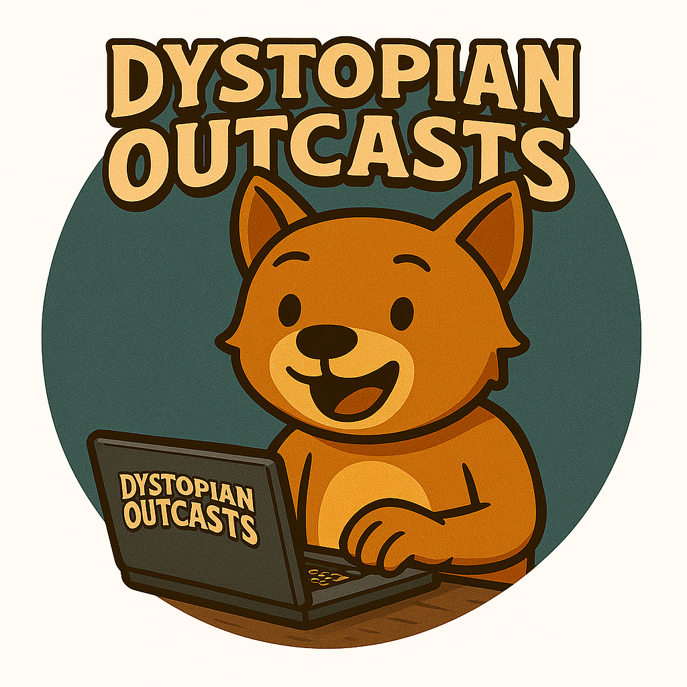

<!--
 * Coded by Raxdeg
 * From the Dystopian Outcasts PZ Server
 * Discord: https://discord.gg/KgNBWyfcvZ
 *
 * Interested in modding, working on, or playing on our server?
 * Join our Discord community!
-->

# Project Zomboid Modding Wiki

> Your guide to surviving the apocalypse... with code

A comprehensive, community-driven documentation wiki for Project Zomboid modding and mapping. Built with React + TypeScript and hosted statically on GitHub Pages.

---

## Features

- **Fuzzy Search** - Instant search with typo tolerance powered by Fuse.js
- **Dark/Light Theme** - Toggle between themes with automatic preference detection
- **Version Support** - Documentation organized by game version (Build 41, Build 42, etc.)
- **Two Main Sections** - Modding (Lua, recipes, items) and Mapping (TileZed, WorldEd)
- **Mobile Responsive** - Full functionality on all device sizes
- **Offline Caching** - IndexedDB caching for fast repeat visits
- **Static Hosting** - No server required, runs entirely in the browser

---

## Documentation Coverage

### Modding Section

| Category | Description |
|----------|-------------|
| **Lua API** | Events, callbacks, Java-Lua bridge, and core API reference |
| **Recipes** | Crafting recipe syntax, parameters, and examples |
| **Items** | Item definitions, properties, types, and equipment |
| **Game Mechanics** | Injury system, XP/skills, literature, animations, sounds |
| **Weapon Repair** | Durability system, fixing.txt, repair formulas |
| **Foraging** | Foraging zones, skill requirements, custom items |
| **Tools** | Debugging utilities, development setup |

### Mapping Section

| Category | Description |
|----------|-------------|
| **TileZed** | Tile editor setup, usage, and tutorials |
| **WorldEd** | World editor documentation |
| **Buildings** | Building creation and placement |
| **Terrain** | Terrain editing and generation |

---

## Tech Stack

| Technology | Purpose |
|------------|---------|
| **React 18** | UI framework |
| **TypeScript** | Type safety |
| **Vite** | Build tool and dev server |
| **React Router** | Client-side routing |
| **Fuse.js** | Fuzzy search |
| **react-markdown** | Markdown rendering with GFM support |
| **rehype-highlight** | Syntax highlighting for code blocks |
| **IndexedDB (idb)** | Client-side caching |
| **CSS Custom Properties** | Theming system |

---

## Project Structure

```
Dystopian_Wiki/
├── .github/
│   └── workflows/
│       └── deploy.yml          # GitHub Actions deployment
├── public/
│   ├── assets/
│   │   └── branding/           # Logos, favicons, banners
│   └── data/
│       ├── versions.json       # Version registry
│       ├── sections.json       # Section definitions
│       ├── search-index.json   # Search index
│       └── build-41/           # Version-specific content
│           ├── modding/        # Modding documentation
│           │   ├── lua-api/
│           │   ├── recipes/
│           │   ├── items/
│           │   ├── game-mechanics/
│           │   ├── weapon-repair/
│           │   ├── foraging/
│           │   └── tools/
│           └── mapping/        # Mapping documentation
│               ├── tilezed/
│               ├── worlded/
│               ├── buildings/
│               └── terrain/
├── src/
│   ├── components/
│   │   ├── landing/            # Hero, QuickstartGrid, SectionBrowser
│   │   ├── layout/             # Header, Footer, Sidebar, Layout
│   │   ├── search/             # FuzzySearchBar, SearchResults
│   │   ├── wiki/               # MarkdownRenderer, CodeBlock, TOC
│   │   └── ui/                 # ThemeToggle, Button, Card
│   ├── hooks/                  # useTheme, useSearch, useWikiData
│   ├── pages/                  # HomePage, ArticlePage, SearchPage, etc.
│   ├── styles/
│   │   ├── variables.css       # Design tokens & color palette
│   │   ├── base.css            # Global styles
│   │   └── components/         # Component-specific styles
│   ├── types/                  # TypeScript interfaces
│   └── utils/                  # Storage, helpers
├── package.json
├── vite.config.ts
└── tsconfig.json
```

---

## URL Structure

```
/                                    # Landing page
/build-41/                           # Version landing
/build-41/modding/                   # Section landing
/build-41/modding/lua-api/           # Category listing
/build-41/modding/lua-api/events     # Individual article
/build-41/mapping/tilezed/basics     # Mapping article
/search?q=recipe&version=build-41    # Search results
```

---

## Color Palette

The wiki uses a custom color palette derived from Dystopian Outcasts branding:

| Color | Hex | Usage |
|-------|-----|-------|
| **Navy Blue** | `#1e3a5f` | Primary brand color, headers, links |
| **Orange/Copper** | `#d4782c` | Accent color, highlights, CTAs |
| **Purple** | `#6b4d8a` | Special badges, "New" labels, alerts |
| **Cream** | `#f8f6f3` | Light theme background |

Both light and dark themes are supported with full color scale variations.

---

## Development

### Prerequisites

- Node.js 18+
- npm 9+

### Setup

```bash
# Clone the repository
git clone https://github.com/YOUR_USERNAME/pz-modding-wiki.git
cd pz-modding-wiki

# Install dependencies
npm install

# Start development server
npm run dev
```

The dev server runs at `http://localhost:5173/pz-modding-wiki/`

### Build

```bash
# Production build
npm run build

# Preview production build locally
npm run preview
```

### Scripts

| Command | Description |
|---------|-------------|
| `npm run dev` | Start development server with hot reload |
| `npm run build` | Build for production |
| `npm run preview` | Preview production build |
| `npm run lint` | Run ESLint |
| `npm run build:search` | Rebuild search index |

---

## Deployment

The wiki automatically deploys to GitHub Pages when pushing to the `main` branch via GitHub Actions.

### Manual Deployment

1. Update `base` in `vite.config.ts` to match your repository name
2. Push to `main` branch
3. GitHub Actions will build and deploy automatically

### Configuration

In `vite.config.ts`, update the base path:

```typescript
export default defineConfig({
  base: '/your-repo-name/',
  // ...
})
```

---

## Contributing

### Adding Documentation

1. Create a JSON file in the appropriate category folder under `public/data/build-XX/`
2. Follow the article schema:

```json
{
  "id": "unique-id",
  "title": "Article Title",
  "slug": "url-slug",
  "version": "build-41",
  "section": "modding",
  "category": "lua-api",
  "tags": ["lua", "events", "api"],
  "content": "# Markdown content here...",
  "excerpt": "Brief description for search results",
  "lastUpdated": "2024-01-15",
  "difficulty": "beginner",
  "tableOfContents": []
}
```

3. Run `npm run build:search` to update the search index
4. Submit a pull request

### Code Contributions

1. Fork the repository
2. Create a feature branch (`git checkout -b feature/amazing-feature`)
3. Commit your changes (`git commit -m 'Add amazing feature'`)
4. Push to the branch (`git push origin feature/amazing-feature`)
5. Open a Pull Request

---

## Roadmap

### Completed

- [x] Phase 1: Project setup (Vite, React, TypeScript)
- [x] Phase 2: Landing page (Hero, Search, Quickstart cards, Section browser)
- [x] Core layout (Header, Footer, theme toggle)
- [x] GitHub Actions deployment workflow

### In Progress / Planned

- [ ] Phase 3: Core layout refinements (Sidebar navigation, Breadcrumbs, Mobile menu)
- [ ] Phase 4: Wiki components (Markdown renderer, Code blocks with copy, Table of contents)
- [ ] Phase 5: Data layer (IndexedDB caching, Data fetching hooks)
- [ ] Phase 6: Wiki pages (Version, Section, Category, Article, Search pages)
- [ ] Phase 7: Content migration (Import vanilla PZ documentation)
- [ ] Phase 8: Production deployment

### Future Enhancements

- [ ] Version comparison / diff view
- [ ] Contribution guidelines in-app
- [ ] Article feedback system
- [ ] Print-friendly article views
- [ ] PDF export for articles

---

## Data Sources

This wiki documents **vanilla Project Zomboid** systems only. Documentation is derived from:

- Official PZ Lua API analysis
- Game file research (scripts, fixing.txt, foraging definitions)
- Community knowledge and testing

**Note:** Proprietary mod content (custom server mods, private systems) is not included in this public wiki.

---

## License

This project is open source. The documentation content covers vanilla Project Zomboid mechanics.

Project Zomboid is developed by [The Indie Stone](https://projectzomboid.com/). This wiki is a community project and is not officially affiliated with The Indie Stone.

---

## Community

- **Discord**: [Dystopian Outcasts](https://discord.gg/KgNBWyfcvZ)
- **GitHub Issues**: Report bugs or request features

---

## Acknowledgments

- [The Indie Stone](https://projectzomboid.com/) for creating Project Zomboid
- The PZ modding community for their research and documentation efforts
- [Fuse.js](https://fusejs.io/) for fuzzy search
- [Vite](https://vitejs.dev/) for the blazing fast build tool

---

<p align="center">
  
  <br>
  <em>Made with care by the Dystopian Outcasts community</em>
</p>
